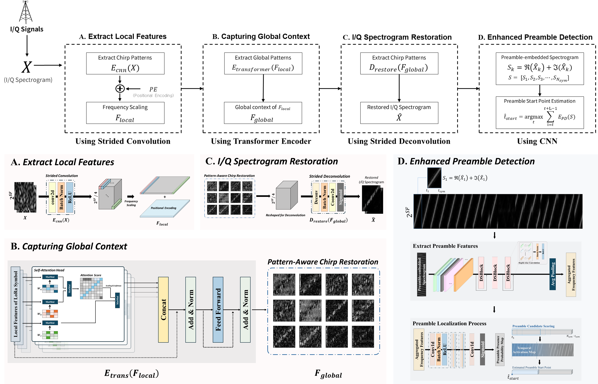
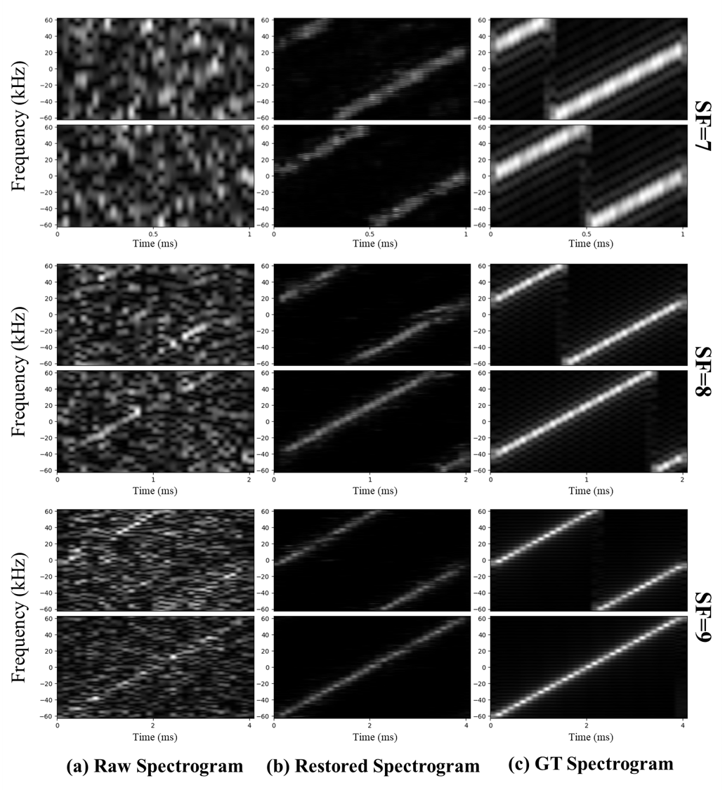

# CALoRa (Chirp-Aware LoRa)
Chirp-Aware Self-Attention for Robust LoRa Preamble Detection under Ultralow SNR

   

This repository contains the official implementation of the paper: **"[Chirp-Aware Self-Attention for Robust LoRa Preamble Detection under Ultralow SNR](https://ieeexplore.ieee.org/abstract/document/11386915)"**, accepted in _IEEE Internet of Things Journal (2026)_.

## 💡 Key Features
- **Enhanced Preamble Detection**: Achieves high detection probability even in ultra-low SNR environments (e.g., under -20dB).
	-  **Symbol Restoration**
    
- **Chirp-Aware Mechanism:** Utilizes a novel self-attention module to effectively capture LoRa chirp characteristics.
	- **Convolutional Neural Network (CNN)**
	- **Transformer Encoder (Self-attention)**
    
- **End-to-End Pipeline:** Includes full support for signal generation, channel simulation, and model training.
	- **Restore-then-Detect**

<h2>Abstract</h2>
In Low-Power Wide-Area Networks (LPWANs) such as LoRa, the preamble is essential for detecting highly attenuated signals. Its repetitive pattern allows a receiver to identify the presence of the signal and its precise starting point. However, in ultra-low Signal-to-Noise Ratio (SNR) environments, the preamble becomes undetectable as it is buried in strong noise, causing the entire detection process to fail. Although existing methods, such as those based on preamble symbol energy accumulation or deep learning-based spectrogram restoration, have been proposed, their performance remains limited under these extreme conditions. To address this limitation, this paper proposes a novel two-stage preamble detection scheme. The first stage employs a Convolutional-Transformer Encoder-Deconvolutional network that leverages self-attention to capture the distinct linear patterns of chirp signals even in the presence of severe noise. In the second stage, a classifier determines the presence of the preamble. Experimental results demonstrate that our proposed method significantly outperforms conventional approaches, lowering the minimum required SNR for preamble detection. To validate its performance, we utilized metrics including True Positive Rate (TPR) and F-scores. Under these evaluations, our scheme achieves a detection accuracy of over 90% in the ultra-low SNR range of -21.7 dB to -24.3 dB, confirming its robustness and practical viability.
</br>





### Example of Symbol Restoration


## 🛠️ Environment & Prerequisites
### Tested System
* ***OS**: Ubuntu 22.04 LTS
* **GPU**: NVIDIA GeForce RTX 4090
* **CUDA**: 12.1 
* **Python**: 3.10 
### Key Dependencies 
* **PyTorch**: 2.1.0 (docker image : pytorch/pytorch:2.1.0-cuda12.1-cudnn8-runtime)
* **NumPy**: 1.26.4; For numerical operations 
* **SciPy**: 1.15.3; For signal processing & LoRa channel simulation 
* **Matplotlib**: 3.10.3; For visualization of detection results

## ⚙️ Installation

```bash
git clone https://github.com/YunSeob/CALoRa.git
cd CALoRa 
pip install -r requirements.txt
```

## 🚀Usage

### 📡Generating Datasets 
**1. Signal Specification** 
Key parameters used for LoRa signal generation:
* **Bandwidth** : 125 kHz 
* **Sampling Rate** : 1 MHz 
* **Modulation:** LoRa Symbol (IQ Data) 
  
**2. Usage**
You can configure the dataset generation using the following arguments:
* **`--symbol`**: Specifies the signal type (Noise level).
	* *Noisy* : SNR range from **-40 dB** to **0 dB** 
	* *Clean* : Fixed SNR of **35 dB** 
* **`--generate_size`**: Number of data samples to generate per SNR level (Default: 32,768).


**3. Output Structure** 
Generated data is saved in '.mat' format within the `./data_symbol/sfX/gen_symbol/` directory.
* **Filename Convention:** `{sym_index}_{snr}_{sf}_{bw}_0_{val}_0_0.mat`

```bash
# Generate Noisy Symbol (generate_size default : 32768)
python generate_symbols.py --symbol noisy --generate_size 1000

# Generate Clean Symbol (generate_size default : 32768)
python generate_symbols.py --symbol clean --generate_size 1000
```

### 📡Preamble-Embedded Data Generation
1. **Frame Structure**
The generated LoRa frames are structured as follows:
	- **Sequence** : Preamble (8 Symbols) + Down-chirp (2 Symbols) + Payload (10 Symbols)
	- **Payload** : Composed of random symbol values.
	- **SNR Range** : -40 dB ~ - 0 dB

2.  **Usage Arguments**
	- **--generate_size** : Defines the number of data samples generated for each SNR level (Default: 100).

3. **Output**
	- The output files are stored in `.mat` format within the `./data_symbol/preamble_train/sfX/gen_symbol/` 
	- **File Naming Rule** : `{sym_index}_{snr}_{sf}_{bw}_0_{payload list}_0_0.mat`

```bash
python generate_preamble_embedded.py --generate_size 100
```

### 📡 Train
We provide training scripts for both Symbol Restoration and Preamble Detection tasks. 
#### 1. Symbol Restoration Model To train the proposed symbol restoration model, run the following command:

```bash
# Train with Spreading Factor 7 and 1M iterations
python train.py --sf 7 --train_iters 100000
```
- **Note:** For the original **NELoRa** training strategy, use the `train_origin.py` script. This serves as a baseline for comparison.
```bash
python train_origin.py --sf 7 --train_iters 100000
```
#### 2. Preamble Detection Model

The training process for Preamble Detection is documented in a Jupyter Notebook for interactive visualization and debugging.

- Please refer to: **train_preamble_detection.ipynb**

### 📊 Prediction & Analysis

We provide Jupyter Notebooks for model inference and detailed performance analysis.
### Interactive Demo

- **predict.ipynb**:
    
    - Demonstrates how to load the trained model and perform inference on test data.
        
    - _Note: This notebook is currently under active development and serves as a usage example._
        
### Performance Analysis

- **analyze_symbol_restoration.ipynb**:
    
    - Contains a detailed analysis of the Symbol Restoration model's performance.
        
    - Includes visualization of restoration accuracy across different SNR levels.
	    
    - Note: This notebook is currently under active development and serves as a usage example.


## Acknowledgement
This code is built upon the official implementation of **NELoRa**. We appreciate their contributions to the open-source community.
- NELoRa Repository: [Github Link Here](https://github.com/hanqingguo/NELoRa-Sensys)

## Citation
If you find this work useful in your research, please consider citing our paper:
```bibtex
@article{kim2026chirp,
  title={Chirp-Aware Self-Attention for Robust LoRa Preamble Detection under Ultra-Low SNR},
  author={Kim, Yun-Seob and Byeon, Seunggyu and Kim, Dong-Hyun and Hasegawa, Mikio and Kim, Jong-Deok},
  journal={IEEE Internet of Things Journal},
  year={2026},
  publisher={IEEE}
}
```
